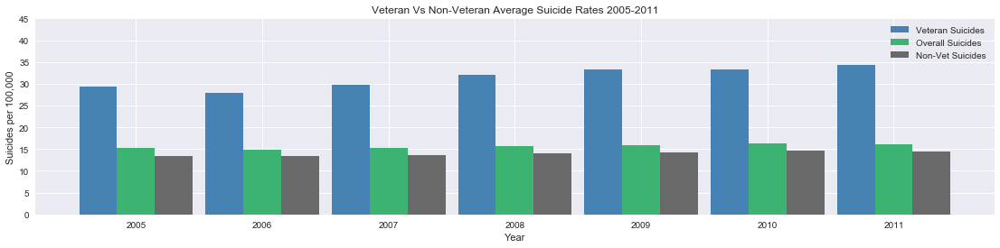
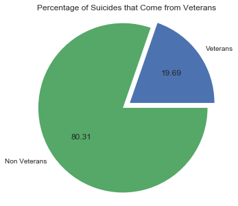
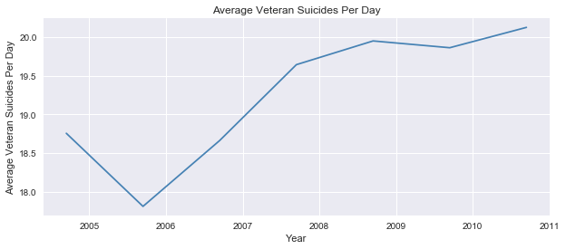
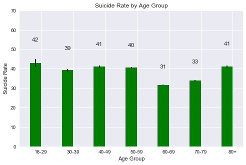
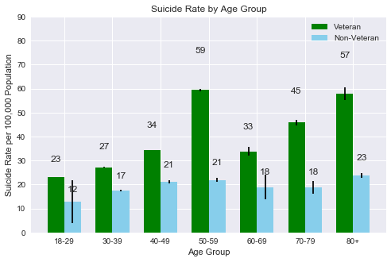
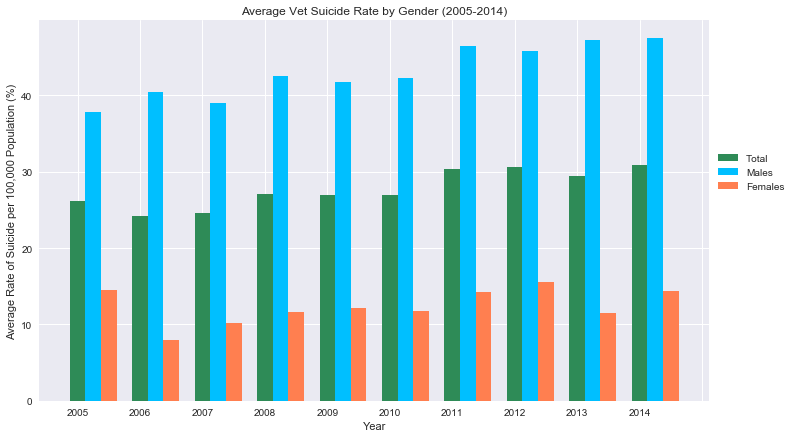
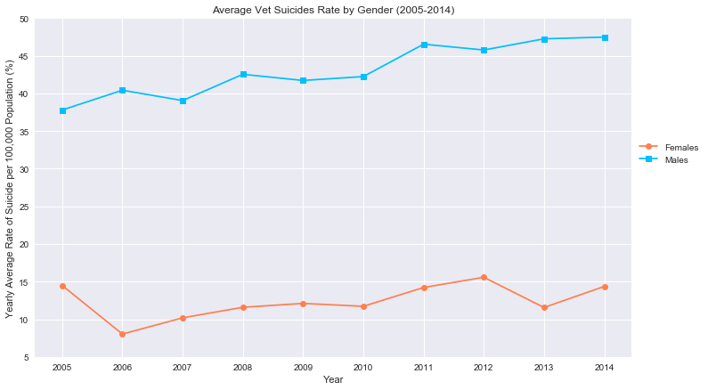

```python
import csv
import pandas as pd
import numpy as np
import scipy.stats as st
import seaborn as sns
import matplotlib.pyplot as plt
```


```python
# Read CSVs
csv2005_df = pd.read_csv("veteran_data/2005.csv", index_col=0)
csv2006_df = pd.read_csv("veteran_data/2006.csv", index_col=0)
csv2007_df = pd.read_csv("veteran_data/2007.csv", index_col=0)
csv2008_df = pd.read_csv("veteran_data/2008.csv", index_col=0)
csv2009_df = pd.read_csv("veteran_data/2009.csv", index_col=0)
csv2010_df = pd.read_csv("veteran_data/2010.csv", index_col=0)
csv2011_df = pd.read_csv("veteran_data/2011.csv", index_col=0)
csv2005_df.head()
```


<div>
<style scoped>
    .dataframe tbody tr th:only-of-type {
        vertical-align: middle;
    }

    .dataframe tbody tr th {
        vertical-align: top;
    }

    .dataframe thead th {
        text-align: right;
    }
</style>
<table border="1" class="dataframe">
  <thead>
    <tr style="text-align: right;">
      <th></th>
      <th>state</th>
      <th>vet_pop_2005</th>
      <th>overall_pop_18_2005</th>
      <th>vet_pop_p_2005</th>
      <th>vet_suicides_2005</th>
      <th>all_suicides_2005</th>
      <th>vet_suicides_p_2005</th>
      <th>vet_males</th>
      <th>vet_males_p</th>
      <th>vet_females</th>
      <th>...</th>
      <th>vet_40_49</th>
      <th>vet_35-54</th>
      <th>vet_45_54</th>
      <th>vet_50_59</th>
      <th>vet_45_64</th>
      <th>vet_55_64</th>
      <th>vet_60</th>
      <th>vet_65</th>
      <th>vet_rate</th>
      <th>civ_rate</th>
    </tr>
  </thead>
  <tbody>
    <tr>
      <th>0</th>
      <td>Alabama</td>
      <td>403950</td>
      <td>3344721</td>
      <td>0.120772</td>
      <td>135</td>
      <td>535</td>
      <td>0.252336</td>
      <td>NaN</td>
      <td>0.000000</td>
      <td>NaN</td>
      <td>...</td>
      <td>NaN</td>
      <td>NaN</td>
      <td>NaN</td>
      <td>NaN</td>
      <td>NaN</td>
      <td>NaN</td>
      <td>NaN</td>
      <td>NaN</td>
      <td>33.419978</td>
      <td>13.601875</td>
    </tr>
    <tr>
      <th>1</th>
      <td>Alaska</td>
      <td>74482</td>
      <td>446969</td>
      <td>0.166638</td>
      <td>24</td>
      <td>131</td>
      <td>0.183206</td>
      <td>22.0</td>
      <td>0.916667</td>
      <td>2.0</td>
      <td>...</td>
      <td>NaN</td>
      <td>NaN</td>
      <td>9.0</td>
      <td>NaN</td>
      <td>NaN</td>
      <td>5.0</td>
      <td>NaN</td>
      <td>4.0</td>
      <td>32.222550</td>
      <td>28.725835</td>
    </tr>
    <tr>
      <th>2</th>
      <td>Arizona</td>
      <td>538880</td>
      <td>4238996</td>
      <td>0.127124</td>
      <td>225</td>
      <td>945</td>
      <td>0.238095</td>
      <td>NaN</td>
      <td>0.000000</td>
      <td>NaN</td>
      <td>...</td>
      <td>NaN</td>
      <td>NaN</td>
      <td>NaN</td>
      <td>NaN</td>
      <td>NaN</td>
      <td>NaN</td>
      <td>NaN</td>
      <td>NaN</td>
      <td>41.753266</td>
      <td>19.458849</td>
    </tr>
    <tr>
      <th>3</th>
      <td>Arkansas</td>
      <td>259304</td>
      <td>2023819</td>
      <td>0.128126</td>
      <td>81</td>
      <td>400</td>
      <td>0.202500</td>
      <td>79.0</td>
      <td>0.975309</td>
      <td>2.0</td>
      <td>...</td>
      <td>NaN</td>
      <td>NaN</td>
      <td>NaN</td>
      <td>NaN</td>
      <td>NaN</td>
      <td>16.0</td>
      <td>NaN</td>
      <td>25.0</td>
      <td>31.237466</td>
      <td>18.078622</td>
    </tr>
    <tr>
      <th>4</th>
      <td>California</td>
      <td>2193336</td>
      <td>25543447</td>
      <td>0.085867</td>
      <td>633</td>
      <td>3206</td>
      <td>0.197442</td>
      <td>613.0</td>
      <td>0.968404</td>
      <td>20.0</td>
      <td>...</td>
      <td>NaN</td>
      <td>NaN</td>
      <td>NaN</td>
      <td>NaN</td>
      <td>220.0</td>
      <td>NaN</td>
      <td>NaN</td>
      <td>317.0</td>
      <td>28.860147</td>
      <td>11.019220</td>
    </tr>
  </tbody>
</table>
<p>5 rows × 28 columns</p>
</div>


```python
# Clean CSVs by dropping columns with missing information
cleaned2005 = csv2005_df.drop(columns=['vet_males', 'vet_males_p','vet_females','vet_females_p','vet_15_24','vet_18_29','vet_17_34','vet_25_34','vet_30_39','vet_25_44','vet_35_44','vet_40_49','vet_35-54','vet_45_54','vet_50_59','vet_45_64','vet_55_64','vet_60','vet_65','vet_rate','civ_rate'])
cleaned2006 = csv2006_df.drop(columns=['vet_males','vet_males_p','vet_females','vet_females_p','vet_15_24','vet_18_29','vet_17_34','vet_25_34','vet_30_39','vet_25_44','vet_35_44','vet_40_49','vet_35-54','vet_45_54','vet_50_59','vet_45_64','vet_55_64','vet_60','vet_65','vet_rate','civ_rate'])
cleaned2007 = csv2007_df.drop(columns=['vet_males','vet_males_p','vet_females','vet_females_p','vet_15_24','vet_18_29','vet_17_34','vet_25_34','vet_30_39','vet_25_44','vet_35_44','vet_40_49','vet_35-54','vet_45_54','vet_50_59','vet_45_64','vet_55_64','vet_60','vet_65','vet_rate','civ_rate'])
cleaned2008 = csv2008_df.drop(columns=['vet_males','vet_males_p','vet_females','vet_females_p','vet_15_24','vet_18_29','vet_17_34','vet_25_34','vet_30_39','vet_25_44','vet_35_44','vet_40_49','vet_35-54','vet_45_54','vet_50_59','vet_45_64','vet_55_64','vet_60','vet_65','vet_rate','civ_rate'])
cleaned2009 = csv2009_df.drop(columns=['vet_males','vet_males_p','vet_females','vet_females_p','vet_15_24','vet_18_29','vet_17_34','vet_25_34','vet_30_39','vet_25_44','vet_35_44','vet_40_49','vet_35-54','vet_45_54','vet_50_59','vet_45_64','vet_55_64','vet_60','vet_65','vet_rate','civ_rate'])
cleaned2010 = csv2010_df.drop(columns=['vet_males','vet_males_p','vet_females','vet_females_p','vet_15_24','vet_18_29','vet_17_34','vet_25_34','vet_30_39','vet_25_44','vet_35_44','vet_40_49','vet_35-54','vet_45_54','vet_50_59','vet_45_64','vet_55_64','vet_60','vet_65','vet_rate','civ_rate'])
cleaned2011 = csv2011_df.drop(columns=['vet_males','vet_males_p','vet_females','vet_females_p','vet_15_24','vet_18_29','vet_17_34','vet_25_34','vet_30_39','vet_25_44','vet_35_44','vet_40_49','vet_35-54','vet_45_54','vet_50_59','vet_45_64','vet_55_64','vet_60','vet_65','vet_rate','civ_rate'])
to_be_merged = ['cleaned2005', 'cleaned2006', 'cleaned2007', 'cleaned2008', 'cleaned2009', 'cleaned2010', 'cleaned2011']
```


```python
# Merge CSVs to create new CSV
merged = pd.merge(cleaned2005, cleaned2006, how='outer', on='state')
merged = pd.merge(merged, cleaned2007, how='outer', on='state')
merged = pd.merge(merged, cleaned2008, how='outer', on='state')
merged = pd.merge(merged, cleaned2009, how='outer', on='state')
merged = pd.merge(merged, cleaned2010, how='outer', on='state')
merged = pd.merge(merged, cleaned2011, how='outer', on='state')
merged.to_csv('veteran_data/veteran_suicides_2005-2011.csv')
```

## Veteran Suicides in the United States (2005 - 2011)


```python
# Open new CSV
veterans_df = pd.read_csv("veteran_data/veteran_suicides_2005-2011.csv")
veterans_df = veterans_df.drop(columns='Unnamed: 0')
veterans_df.head()
```


<div>
<style scoped>
    .dataframe tbody tr th:only-of-type {
        vertical-align: middle;
    }

    .dataframe tbody tr th {
        vertical-align: top;
    }

    .dataframe thead th {
        text-align: right;
    }
</style>
<table border="1" class="dataframe">
  <thead>
    <tr style="text-align: right;">
      <th></th>
      <th>state</th>
      <th>vet_pop_2005</th>
      <th>overall_pop_18_2005</th>
      <th>vet_pop_p_2005</th>
      <th>vet_suicides_2005</th>
      <th>all_suicides_2005</th>
      <th>vet_suicides_p_2005</th>
      <th>vet_pop_2006</th>
      <th>overall_pop_18_2006</th>
      <th>vet_pop_p_2006</th>
      <th>...</th>
      <th>vet_pop_p_2010</th>
      <th>vet_suicides_2010</th>
      <th>all_suicides_2010</th>
      <th>vet_suicides_p_2010</th>
      <th>vet_pop_2011</th>
      <th>overall_pop_18_2011</th>
      <th>vet_pop_p_2011</th>
      <th>vet_suicides_2011</th>
      <th>all_suicides_2011</th>
      <th>vet_suicides_p_2011</th>
    </tr>
  </thead>
  <tbody>
    <tr>
      <th>0</th>
      <td>Alabama</td>
      <td>403950</td>
      <td>3344721</td>
      <td>0.120772</td>
      <td>135</td>
      <td>535</td>
      <td>0.252336</td>
      <td>408917</td>
      <td>3473558</td>
      <td>0.117723</td>
      <td>...</td>
      <td>0.110360</td>
      <td>156</td>
      <td>679</td>
      <td>0.229750</td>
      <td>395753</td>
      <td>3662910</td>
      <td>0.108043</td>
      <td>163</td>
      <td>680</td>
      <td>0.239706</td>
    </tr>
    <tr>
      <th>1</th>
      <td>Alaska</td>
      <td>74482</td>
      <td>446969</td>
      <td>0.166638</td>
      <td>24</td>
      <td>131</td>
      <td>0.183206</td>
      <td>70067</td>
      <td>478581</td>
      <td>0.146406</td>
      <td>...</td>
      <td>0.140705</td>
      <td>35</td>
      <td>164</td>
      <td>0.213415</td>
      <td>72407</td>
      <td>517799</td>
      <td>0.139836</td>
      <td>27</td>
      <td>142</td>
      <td>0.190141</td>
    </tr>
    <tr>
      <th>2</th>
      <td>Arizona</td>
      <td>538880</td>
      <td>4238996</td>
      <td>0.127124</td>
      <td>225</td>
      <td>945</td>
      <td>0.238095</td>
      <td>558906</td>
      <td>4521911</td>
      <td>0.123600</td>
      <td>...</td>
      <td>0.111217</td>
      <td>240</td>
      <td>1093</td>
      <td>0.219579</td>
      <td>533608</td>
      <td>4842927</td>
      <td>0.110183</td>
      <td>242</td>
      <td>1091</td>
      <td>0.221815</td>
    </tr>
    <tr>
      <th>3</th>
      <td>Arkansas</td>
      <td>259304</td>
      <td>2023819</td>
      <td>0.128126</td>
      <td>81</td>
      <td>400</td>
      <td>0.202500</td>
      <td>258170</td>
      <td>2110583</td>
      <td>0.122322</td>
      <td>...</td>
      <td>0.112340</td>
      <td>105</td>
      <td>447</td>
      <td>0.234899</td>
      <td>238790</td>
      <td>2221409</td>
      <td>0.107495</td>
      <td>89</td>
      <td>447</td>
      <td>0.199105</td>
    </tr>
    <tr>
      <th>4</th>
      <td>California</td>
      <td>2193336</td>
      <td>25543447</td>
      <td>0.085867</td>
      <td>633</td>
      <td>3206</td>
      <td>0.197442</td>
      <td>2142367</td>
      <td>26789221</td>
      <td>0.079971</td>
      <td>...</td>
      <td>0.069784</td>
      <td>705</td>
      <td>3913</td>
      <td>0.180169</td>
      <td>1910994</td>
      <td>28292703</td>
      <td>0.067544</td>
      <td>706</td>
      <td>3923</td>
      <td>0.179964</td>
    </tr>
  </tbody>
</table>
<p>5 rows × 43 columns</p>
</div>


```python
#Calculate the Suicides per 100,000 People
vet_per_cap_suic_per_year_list = []
for year in np.arange(2005,2012,1):
       vet_per_cap_suic_per_year_list.append(((veterans_df[f"vet_suicides_{year}"].sum())/(veterans_df[f"vet_pop_{year}"].sum()))*100000)

non_vet_suic_per_year_list = []
for year in np.arange(2005,2012,1):
       non_vet_suic_per_year_list.append(((veterans_df[f"all_suicides_{year}"].sum()-veterans_df[f"vet_suicides_{year}"].sum())/(veterans_df[f"overall_pop_18_{year}"].sum()-veterans_df[f"vet_pop_{year}"].sum()))*100000)

gen_pop_suic_per_year_list = []
for year in np.arange(2005,2012,1):
       gen_pop_suic_per_year_list.append(((veterans_df[f"all_suicides_{year}"].sum())/(veterans_df[f"overall_pop_18_{year}"].sum()))*100000)
```


```python
#Graph the Suicide Rates
sns.set()
x = np.arange(2005, 2012, 1) 
plt.figure(figsize=(19,4))

plt.bar(x-.3, vet_per_cap_suic_per_year_list, label="Veteran Suicides", width=.3, color='steelblue')
plt.bar(x, gen_pop_suic_per_year_list, label="Overall Suicides",width=.3, color='mediumseagreen')
plt.bar(x+.3, non_vet_suic_per_year_list, label="Non-Vet Suicides",width=.3, color='dimgrey')

plt.xlabel("Year")
plt.ylabel("Suicides per 100,000")
plt.title("Veteran Vs Non-Veteran Average Suicide Rates 2005-2011")
plt.legend()
plt.ylim(0, 45)
plt.show()
```





```python
# What percentage of suicides come from veterans
total_vet_suicides_list = []
total_non_vet_suicides_list = []
for year in np.arange(2005,2012,1):
    total_vet_suicides_list.append(veterans_df[f"vet_suicides_{year}"].sum())
    total_non_vet_suicides_list.append(veterans_df[f"all_suicides_{year}"].sum()-veterans_df[f"vet_suicides_{year}"].sum())
total_vet_suicides = np.sum(total_vet_suicides_list)
total_non_vet_suicides = np.sum(total_non_vet_suicides_list)

plt.figure(figsize=(5,5))
plt.title("Percentage of Suicides that Come from Veterans")
plt.pie(
    [total_vet_suicides, total_non_vet_suicides],
    explode=[.1,0],
    labels=["Veterans", "Non Veterans"],
    autopct='%.2f',
    pctdistance=.6)
plt.axis('equal')
plt.show()
```





```python
# Average veteran suicides per day
sns.set()
x = np.arange(2005, 2012, 1)
plt.figure(figsize=(10,4))
plt.title("Average Veteran Suicides Per Day")
plt.xlabel("Year")
plt.ylabel("Average Veteran Suicides Per Day")
plt.plot(x-.3, np.divide(total_vet_suicides_list, 365), label="Average Veteran Suicides Per Day", color='steelblue')
plt.show()
```





## Veteran Suicides by State (2005 - 2011)

## Veteran Suicides by Age Group


```python
# Read CSVs and create dataframe
vets1_df = pd.read_csv("veteran_data/Vet Suicides 2005-2014 (Age Groups).csv") 
vets2_df = pd.read_csv("veteran_data/veteran_suicide_age_2005-2008.csv") 
vets1_df.head(7)
vets_by_age_2014 = vets1_df.set_index("age range")
vets_by_age_2014.head(7)
```


<div>
<style scoped>
    .dataframe tbody tr th:only-of-type {
        vertical-align: middle;
    }

    .dataframe tbody tr th {
        vertical-align: top;
    }

    .dataframe thead th {
        text-align: right;
    }
</style>
<table border="1" class="dataframe">
  <thead>
    <tr style="text-align: right;">
      <th></th>
      <th>2005</th>
      <th>2006</th>
      <th>2007</th>
      <th>2008</th>
      <th>2009</th>
      <th>2010</th>
      <th>2011</th>
      <th>2012</th>
      <th>2013</th>
      <th>2014</th>
    </tr>
    <tr>
      <th>age range</th>
      <th></th>
      <th></th>
      <th></th>
      <th></th>
      <th></th>
      <th></th>
      <th></th>
      <th></th>
      <th></th>
      <th></th>
    </tr>
  </thead>
  <tbody>
    <tr>
      <th>18-29</th>
      <td>21.2</td>
      <td>35.5</td>
      <td>29.7</td>
      <td>36.8</td>
      <td>37.7</td>
      <td>44.5</td>
      <td>50.6</td>
      <td>54.4</td>
      <td>60.7</td>
      <td>58.4</td>
    </tr>
    <tr>
      <th>30-39</th>
      <td>36.9</td>
      <td>35.8</td>
      <td>36.0</td>
      <td>33.7</td>
      <td>37.2</td>
      <td>39.4</td>
      <td>44.0</td>
      <td>40.5</td>
      <td>43.0</td>
      <td>46.2</td>
    </tr>
    <tr>
      <th>40-49</th>
      <td>44.4</td>
      <td>34.2</td>
      <td>42.1</td>
      <td>42.6</td>
      <td>40.1</td>
      <td>39.2</td>
      <td>45.0</td>
      <td>41.2</td>
      <td>41.1</td>
      <td>41.0</td>
    </tr>
    <tr>
      <th>50-59</th>
      <td>36.5</td>
      <td>41.1</td>
      <td>38.7</td>
      <td>43.5</td>
      <td>42.1</td>
      <td>42.0</td>
      <td>45.5</td>
      <td>41.1</td>
      <td>35.0</td>
      <td>39.7</td>
    </tr>
    <tr>
      <th>60-69</th>
      <td>29.9</td>
      <td>31.7</td>
      <td>31.4</td>
      <td>36.7</td>
      <td>31.5</td>
      <td>32.3</td>
      <td>30.5</td>
      <td>29.2</td>
      <td>31.0</td>
      <td>32.2</td>
    </tr>
    <tr>
      <th>70-79</th>
      <td>31.4</td>
      <td>34.2</td>
      <td>30.3</td>
      <td>32.6</td>
      <td>33.5</td>
      <td>32.0</td>
      <td>32.8</td>
      <td>36.3</td>
      <td>41.1</td>
      <td>34.1</td>
    </tr>
    <tr>
      <th>80+</th>
      <td>40.4</td>
      <td>36.9</td>
      <td>37.8</td>
      <td>40.8</td>
      <td>41.8</td>
      <td>35.4</td>
      <td>43.5</td>
      <td>44.7</td>
      <td>44.1</td>
      <td>45.8</td>
    </tr>
  </tbody>
</table>
</div>


```python
# Calculate the mean and standard error
avg_18_29_mean = (vets_by_age_2014.loc["18-29"]).mean()
avg_30_39_mean = (vets_by_age_2014.loc["30-39"]).mean()
avg_40_49_mean = (vets_by_age_2014.loc["40-49"]).mean()
avg_50_59_mean = (vets_by_age_2014.loc["50-59"]).mean()
avg_60_69_mean = (vets_by_age_2014.loc["60-69"]).mean()
avg_70_79_mean = (vets_by_age_2014.loc["70-79"]).mean()
avg_80_mean = (vets_by_age_2014.loc["80+"]).mean()

std_18_29_mean = st.stats.sem(vets_by_age_2014.loc["18-29"])/4
std_30_39_mean = st.stats.sem(vets_by_age_2014.loc["30-39"])/4
std_40_49_mean = st.stats.sem(vets_by_age_2014.loc["40-49"])/4
std_50_59_mean = st.stats.sem(vets_by_age_2014.loc["50-59"])/4
std_60_69_mean = st.stats.sem(vets_by_age_2014.loc["60-69"])/4
std_70_79_mean = st.stats.sem(vets_by_age_2014.loc["70-79"])/4
std_80_mean = st.stats.sem(vets_by_age_2014.loc["80+"])/4

data1 = [['18-29',avg_18_29_mean,std_18_29_mean],['30-39',avg_30_39_mean,std_30_39_mean],['40-49',avg_40_49_mean,std_40_49_mean],['50-59',avg_50_59_mean,std_50_59_mean],['60-69',avg_60_69_mean,std_60_69_mean],['70-79',avg_70_79_mean,std_70_79_mean],['80+',avg_80_mean,std_80_mean]]
final_data1 = pd.DataFrame(data1,columns=['Age Group','Mean','STD'])
final_data1
```


<div>
<style scoped>
    .dataframe tbody tr th:only-of-type {
        vertical-align: middle;
    }

    .dataframe tbody tr th {
        vertical-align: top;
    }

    .dataframe thead th {
        text-align: right;
    }
</style>
<table border="1" class="dataframe">
  <thead>
    <tr style="text-align: right;">
      <th></th>
      <th>Age Group</th>
      <th>Mean</th>
      <th>STD</th>
    </tr>
  </thead>
  <tbody>
    <tr>
      <th>0</th>
      <td>18-29</td>
      <td>42.95</td>
      <td>1.025814</td>
    </tr>
    <tr>
      <th>1</th>
      <td>30-39</td>
      <td>39.27</td>
      <td>0.322211</td>
    </tr>
    <tr>
      <th>2</th>
      <td>40-49</td>
      <td>41.09</td>
      <td>0.238032</td>
    </tr>
    <tr>
      <th>3</th>
      <td>50-59</td>
      <td>40.52</td>
      <td>0.249522</td>
    </tr>
    <tr>
      <th>4</th>
      <td>60-69</td>
      <td>31.64</td>
      <td>0.160563</td>
    </tr>
    <tr>
      <th>5</th>
      <td>70-79</td>
      <td>33.83</td>
      <td>0.240891</td>
    </tr>
    <tr>
      <th>6</th>
      <td>80+</td>
      <td>41.12</td>
      <td>0.278757</td>
    </tr>
  </tbody>
</table>
</div>


```python
# Plot Bar Chart for final_data1
N = 7
fig, ax = plt.subplots()
ind = np.arange(N)  # the x locations for the groups
width = 0.35       # the width of the bars


recs1 = ax.bar(ind,final_data1['Mean'], width, color='green', yerr=2*final_data1['STD'])

# Add some text for labels, title and axes ticks
ax.set_ylabel('Suicide Rate')
ax.set_xlabel('Age Group')
ax.set_title('Suicide Rate by Age Group')
ax.set_xticks(ind + width / 2)
ax.set_xticklabels(('18-29', '30-39', '40-49', '50-59', '60-69', '70-79', '80+'))
plt.ylim(0,70,10)
plt.legend()
sns.set(rc={'figure.figsize':(8,5)})
def autolabel(rects):
    """
    Attach a text label above each bar displaying its height
    """
    for rect in rects:
        height = rect.get_height()
        ax.text(rect.get_x() + rect.get_width()/2., 1.25*height,
                '%d' % int(height),
                ha='center', va='bottom')

autolabel(recs1)
plt.show()
```





```python
# Create dataframe for vets2_df
vets_age_df_2008 = vets2_df
vets_age_df_2008 = vets_age_df_2008.set_index('age_range')
vets_age_df_2008.head(7)
```


<div>
<style scoped>
    .dataframe tbody tr th:only-of-type {
        vertical-align: middle;
    }

    .dataframe tbody tr th {
        vertical-align: top;
    }

    .dataframe thead th {
        text-align: right;
    }
</style>
<table border="1" class="dataframe">
  <thead>
    <tr style="text-align: right;">
      <th></th>
      <th>vet_suicide_2005</th>
      <th>vet_suicide_2006</th>
      <th>vet_suicide_2007</th>
      <th>vet_suicide_2008</th>
      <th>Nonvet_suicide_2005</th>
      <th>Nonvet_suicide_2006</th>
      <th>Nonvet_suicide_2007</th>
      <th>Nonvet_suicide_2008</th>
      <th>vet_pop_16sates</th>
      <th>v_rate_pop</th>
      <th>nonvet_pop_16sates</th>
      <th>nv_rate_pop</th>
    </tr>
    <tr>
      <th>age_range</th>
      <th></th>
      <th></th>
      <th></th>
      <th></th>
      <th></th>
      <th></th>
      <th></th>
      <th></th>
      <th></th>
      <th></th>
      <th></th>
      <th></th>
    </tr>
  </thead>
  <tbody>
    <tr>
      <th>18-29</th>
      <td>12</td>
      <td>11</td>
      <td>23</td>
      <td>15</td>
      <td>86</td>
      <td>552</td>
      <td>759</td>
      <td>910</td>
      <td>65974</td>
      <td>0.201657</td>
      <td>4442150</td>
      <td>0.088096</td>
    </tr>
    <tr>
      <th>30-39</th>
      <td>71</td>
      <td>83</td>
      <td>92</td>
      <td>83</td>
      <td>865</td>
      <td>882</td>
      <td>861</td>
      <td>882</td>
      <td>302379</td>
      <td>0.150336</td>
      <td>4997418</td>
      <td>0.108549</td>
    </tr>
    <tr>
      <th>40-49</th>
      <td>183</td>
      <td>195</td>
      <td>185</td>
      <td>185</td>
      <td>1008</td>
      <td>994</td>
      <td>1049</td>
      <td>1017</td>
      <td>544281</td>
      <td>0.210210</td>
      <td>4804281</td>
      <td>0.111739</td>
    </tr>
    <tr>
      <th>50-59</th>
      <td>486</td>
      <td>453</td>
      <td>495</td>
      <td>487</td>
      <td>1092</td>
      <td>1012</td>
      <td>1062</td>
      <td>1083</td>
      <td>808175</td>
      <td>0.237569</td>
      <td>4852566</td>
      <td>0.114216</td>
    </tr>
    <tr>
      <th>60-69</th>
      <td>385</td>
      <td>450</td>
      <td>525</td>
      <td>553</td>
      <td>495</td>
      <td>321</td>
      <td>810</td>
      <td>615</td>
      <td>1412933</td>
      <td>0.077739</td>
      <td>2969481</td>
      <td>0.106765</td>
    </tr>
    <tr>
      <th>70-79</th>
      <td>494</td>
      <td>565</td>
      <td>485</td>
      <td>462</td>
      <td>427</td>
      <td>196</td>
      <td>216</td>
      <td>226</td>
      <td>1094061</td>
      <td>0.200000</td>
      <td>1424385</td>
      <td>0.102050</td>
    </tr>
    <tr>
      <th>80+</th>
      <td>808</td>
      <td>712</td>
      <td>595</td>
      <td>821</td>
      <td>97</td>
      <td>197</td>
      <td>148</td>
      <td>153</td>
      <td>1269990</td>
      <td>0.280000</td>
      <td>627695</td>
      <td>0.110654</td>
    </tr>
  </tbody>
</table>
</div>


```python
# Calculating standard deviations for vets and non vets by age group
std_18_29 = st.stats.sem(vets_age_df_2008.loc['18-29','vet_suicide_2005':'vet_suicide_2008'])/4
std_30_39 = st.stats.sem(vets_age_df_2008.loc['30-39','vet_suicide_2005':'vet_suicide_2008'])/4
std_40_49 = st.stats.sem(vets_age_df_2008.loc['40-49','vet_suicide_2005':'vet_suicide_2008'])/4
std_50_59 = st.stats.sem(vets_age_df_2008.loc['50-59','vet_suicide_2005':'vet_suicide_2008'])/4
std_60_69 = st.stats.sem(vets_age_df_2008.loc['60-69','vet_suicide_2005':'vet_suicide_2008'])/4
std_70_79 = st.stats.sem(vets_age_df_2008.loc['70-79','vet_suicide_2005':'vet_suicide_2008'])/4
std_80 = st.stats.sem(vets_age_df_2008.loc['80+','vet_suicide_2005':'vet_suicide_2008'])/4 

std_18_29_nonvet = st.stats.sem(vets_age_df_2008.loc['18-29','Nonvet_suicide_2005':'Nonvet_suicide_2008'])/4
std_30_39_nonvet = st.stats.sem(vets_age_df_2008.loc['30-39','Nonvet_suicide_2005':'Nonvet_suicide_2008'])/4
std_40_49_nonvet = st.stats.sem(vets_age_df_2008.loc['40-49','Nonvet_suicide_2005':'Nonvet_suicide_2008'])/4
std_50_59_nonvet = st.stats.sem(vets_age_df_2008.loc['50-59','Nonvet_suicide_2005':'Nonvet_suicide_2008'])/4
std_60_69_nonvet = st.stats.sem(vets_age_df_2008.loc['60-69','Nonvet_suicide_2005':'Nonvet_suicide_2008'])/4
std_70_79_nonvet = st.stats.sem(vets_age_df_2008.loc['70-79','Nonvet_suicide_2005':'Nonvet_suicide_2008'])/4
std_80_nonvet = st.stats.sem(vets_age_df_2008.loc['80+','Nonvet_suicide_2005':'Nonvet_suicide_2008'])/4
```


```python
# Create lists to store standard deviation calculations
vet_suc_age_list = (vets_age_df_2008['vet_suicide_2005']+vets_age_df_2008['vet_suicide_2006']+vets_age_df_2008['vet_suicide_2007']+vets_age_df_2008['vet_suicide_2008'])
vet_suc_pop = vets_age_df_2008['vet_pop_16sates']
nonvet_suc_age_list = (vets_age_df_2008['Nonvet_suicide_2005']+vets_age_df_2008['Nonvet_suicide_2006']+vets_age_df_2008['Nonvet_suicide_2007']+vets_age_df_2008['Nonvet_suicide_2008'])
nonvet_suc_pop = vets_age_df_2008['nonvet_pop_16sates']
```


```python
# Create new dataframe with lists and rename columns
data2 = [['18-29',vet_suc_age_list[0],nonvet_suc_age_list[0],vet_suc_pop[0],nonvet_suc_pop[0],std_18_29,std_18_29_nonvet],['30-39',vet_suc_age_list[1],nonvet_suc_age_list[1],vet_suc_pop[1],nonvet_suc_pop[1],std_30_39,std_30_39_nonvet],['40-49',vet_suc_age_list[2],nonvet_suc_age_list[2],vet_suc_pop[2],nonvet_suc_pop[2],std_40_49,std_40_49_nonvet],['50-59',vet_suc_age_list[3],nonvet_suc_age_list[3],vet_suc_pop[3],nonvet_suc_pop[3],std_50_59,std_50_59_nonvet],['60-69',vet_suc_age_list[4],nonvet_suc_age_list[4],vet_suc_pop[4],nonvet_suc_pop[4],std_60_69,std_60_69_nonvet],['70-79',vet_suc_age_list[5],nonvet_suc_age_list[5],vet_suc_pop[5],nonvet_suc_pop[5],std_70_79,std_70_79_nonvet],['80+',vet_suc_age_list[6],nonvet_suc_age_list[6],vet_suc_pop[6],nonvet_suc_pop[6],std_80,std_80_nonvet]]
data2_df = pd.DataFrame(data2,columns=['Age Group','Total Vet Suicide','Total NonVet Suicide','Veterans Population','Non Veterans Population','Vet Std error','Non-Vet Std error'])
final_data2 = data2_df.set_index('Age Group')
vet_rate = ((final_data2['Total Vet Suicide']/final_data2['Veterans Population'])*100000)/4
non_vet_rate = ((final_data2['Total NonVet Suicide']/final_data2['Non Veterans Population'])*100000)/4
vet_rate.round(2)
non_vet_rate.round(2)
final_data2
```


<div>
<style scoped>
    .dataframe tbody tr th:only-of-type {
        vertical-align: middle;
    }

    .dataframe tbody tr th {
        vertical-align: top;
    }

    .dataframe thead th {
        text-align: right;
    }
</style>
<table border="1" class="dataframe">
  <thead>
    <tr style="text-align: right;">
      <th></th>
      <th>Total Vet Suicide</th>
      <th>Total NonVet Suicide</th>
      <th>Veterans Population</th>
      <th>Non Veterans Population</th>
      <th>Vet Std error</th>
      <th>Non-Vet Std error</th>
    </tr>
    <tr>
      <th>Age Group</th>
      <th></th>
      <th></th>
      <th></th>
      <th></th>
      <th></th>
      <th></th>
    </tr>
  </thead>
  <tbody>
    <tr>
      <th>18-29</th>
      <td>61</td>
      <td>2307</td>
      <td>65974</td>
      <td>4442150</td>
      <td>0.679882</td>
      <td>44.821332</td>
    </tr>
    <tr>
      <th>30-39</th>
      <td>329</td>
      <td>3490</td>
      <td>302379</td>
      <td>4997418</td>
      <td>1.077105</td>
      <td>1.386317</td>
    </tr>
    <tr>
      <th>40-49</th>
      <td>748</td>
      <td>4068</td>
      <td>544281</td>
      <td>4804281</td>
      <td>0.677003</td>
      <td>2.917262</td>
    </tr>
    <tr>
      <th>50-59</th>
      <td>1921</td>
      <td>4249</td>
      <td>808175</td>
      <td>4852566</td>
      <td>2.325974</td>
      <td>4.472573</td>
    </tr>
    <tr>
      <th>60-69</th>
      <td>1913</td>
      <td>2241</td>
      <td>1412933</td>
      <td>2969481</td>
      <td>9.483195</td>
      <td>25.705742</td>
    </tr>
    <tr>
      <th>70-79</th>
      <td>2006</td>
      <td>1065</td>
      <td>1094061</td>
      <td>1424385</td>
      <td>5.553246</td>
      <td>13.486249</td>
    </tr>
    <tr>
      <th>80+</th>
      <td>2936</td>
      <td>595</td>
      <td>1269990</td>
      <td>627695</td>
      <td>13.080281</td>
      <td>5.115718</td>
    </tr>
  </tbody>
</table>
</div>


```python
# Plot Bar Chart for final_data2
N = 7
ind = np.arange(N)  # the x locations for the groups
width = 0.35       # the width of the bars

fig, ax = plt.subplots()
rects1 = ax.bar(ind,vet_rate, width, color='green', yerr=0.2*final_data2['Vet Std error'])


rects2 = ax.bar(ind+width, non_vet_rate, width, color='skyblue', yerr=0.2*final_data2['Non-Vet Std error'])

# Add some text for labels, title and axes ticks
ax.set_ylabel('Suicide Rate per 100,000 Population')
ax.set_xlabel('Age Group')
ax.set_title('Suicide Rate by Age Group')
ax.set_xticks(ind + width / 2)
ax.set_xticklabels(('18-29', '30-39', '40-49', '50-59', '60-69', '70-79', '80+'))
plt.ylim(0,90,10)
ax.legend((rects1[0], rects2[0]), ('Veteran', 'Non-Veteran'))
sns.set(rc={'figure.figsize':(12,7)})

def autolabel(rects):
    """
    Attach a text label above each bar displaying its height
    """
    for rect in rects:
        height = rect.get_height()
        ax.text(rect.get_x() + rect.get_width()/2., 1.25*height,
                '%d' % int(height),
                ha='center', va='bottom')

autolabel(rects1)
autolabel(rects2)

plt.show()
```





## Veteran Suicides by Gender


```python
# Read and create dataframe for female vets
female_vets_df = pd.read_csv("veteran_data/Vet Suicides 2005-2014 (Females).csv")
female_vets_df = female_vets_df.set_index("female")
female_vets_df
```


<div>
<style scoped>
    .dataframe tbody tr th:only-of-type {
        vertical-align: middle;
    }

    .dataframe tbody tr th {
        vertical-align: top;
    }

    .dataframe thead th {
        text-align: right;
    }
</style>
<table border="1" class="dataframe">
  <thead>
    <tr style="text-align: right;">
      <th></th>
      <th>2005</th>
      <th>2006</th>
      <th>2007</th>
      <th>2008</th>
      <th>2009</th>
      <th>2010</th>
      <th>2011</th>
      <th>2012</th>
      <th>2013</th>
      <th>2014</th>
    </tr>
    <tr>
      <th>female</th>
      <th></th>
      <th></th>
      <th></th>
      <th></th>
      <th></th>
      <th></th>
      <th></th>
      <th></th>
      <th></th>
      <th></th>
    </tr>
  </thead>
  <tbody>
    <tr>
      <th>18-29</th>
      <td>6.7</td>
      <td>4.7</td>
      <td>10.2</td>
      <td>5.4</td>
      <td>15.2</td>
      <td>11.1</td>
      <td>19.3</td>
      <td>12.9</td>
      <td>15.7</td>
      <td>11.0</td>
    </tr>
    <tr>
      <th>30-39</th>
      <td>13.8</td>
      <td>10.9</td>
      <td>15.7</td>
      <td>15.9</td>
      <td>14.9</td>
      <td>15.3</td>
      <td>13.5</td>
      <td>14.4</td>
      <td>17.4</td>
      <td>17.6</td>
    </tr>
    <tr>
      <th>40-49</th>
      <td>27.4</td>
      <td>7.8</td>
      <td>14.8</td>
      <td>12.8</td>
      <td>16.7</td>
      <td>17.4</td>
      <td>18.1</td>
      <td>20.3</td>
      <td>20.6</td>
      <td>22.7</td>
    </tr>
    <tr>
      <th>50-59</th>
      <td>7.5</td>
      <td>12.9</td>
      <td>13.8</td>
      <td>25.3</td>
      <td>18.1</td>
      <td>18.8</td>
      <td>18.1</td>
      <td>18.1</td>
      <td>11.8</td>
      <td>20.0</td>
    </tr>
    <tr>
      <th>60-69</th>
      <td>4.8</td>
      <td>6.8</td>
      <td>8.6</td>
      <td>4.0</td>
      <td>9.0</td>
      <td>19.4</td>
      <td>14.7</td>
      <td>11.9</td>
      <td>9.7</td>
      <td>14.5</td>
    </tr>
    <tr>
      <th>70-79</th>
      <td>25.9</td>
      <td>5.3</td>
      <td>0.0</td>
      <td>0.0</td>
      <td>10.8</td>
      <td>0.0</td>
      <td>10.6</td>
      <td>31.4</td>
      <td>0.0</td>
      <td>14.7</td>
    </tr>
    <tr>
      <th>80+</th>
      <td>15.3</td>
      <td>7.8</td>
      <td>8.2</td>
      <td>17.7</td>
      <td>0.0</td>
      <td>0.0</td>
      <td>5.2</td>
      <td>0.0</td>
      <td>5.7</td>
      <td>0.0</td>
    </tr>
  </tbody>
</table>
</div>


```python
# Read and create dataframe for male vets
male_vets_df = pd.read_csv("veteran_data/Vet Suicides 2005-2014 (Males).csv")
male_vets_df = male_vets_df.set_index("male")
male_vets_df
```


<div>
<style scoped>
    .dataframe tbody tr th:only-of-type {
        vertical-align: middle;
    }

    .dataframe tbody tr th {
        vertical-align: top;
    }

    .dataframe thead th {
        text-align: right;
    }
</style>
<table border="1" class="dataframe">
  <thead>
    <tr style="text-align: right;">
      <th></th>
      <th>2005</th>
      <th>2006</th>
      <th>2007</th>
      <th>2008</th>
      <th>2009</th>
      <th>2010</th>
      <th>2011</th>
      <th>2012</th>
      <th>2013</th>
      <th>2014</th>
    </tr>
    <tr>
      <th>male</th>
      <th></th>
      <th></th>
      <th></th>
      <th></th>
      <th></th>
      <th></th>
      <th></th>
      <th></th>
      <th></th>
      <th></th>
    </tr>
  </thead>
  <tbody>
    <tr>
      <th>18-29</th>
      <td>27.8</td>
      <td>48.2</td>
      <td>37.4</td>
      <td>48.4</td>
      <td>45.5</td>
      <td>55.4</td>
      <td>60.4</td>
      <td>67.0</td>
      <td>74.6</td>
      <td>73.3</td>
    </tr>
    <tr>
      <th>30-39</th>
      <td>44.7</td>
      <td>44.3</td>
      <td>43.1</td>
      <td>40.0</td>
      <td>45.1</td>
      <td>47.7</td>
      <td>54.3</td>
      <td>49.2</td>
      <td>51.5</td>
      <td>55.5</td>
    </tr>
    <tr>
      <th>40-49</th>
      <td>48.6</td>
      <td>40.8</td>
      <td>49.1</td>
      <td>50.6</td>
      <td>46.4</td>
      <td>44.8</td>
      <td>51.8</td>
      <td>46.6</td>
      <td>46.3</td>
      <td>45.6</td>
    </tr>
    <tr>
      <th>50-59</th>
      <td>39.3</td>
      <td>44.0</td>
      <td>41.5</td>
      <td>45.9</td>
      <td>45.6</td>
      <td>45.8</td>
      <td>50.2</td>
      <td>45.4</td>
      <td>39.4</td>
      <td>43.6</td>
    </tr>
    <tr>
      <th>60-69</th>
      <td>31.1</td>
      <td>32.9</td>
      <td>32.4</td>
      <td>38.1</td>
      <td>32.4</td>
      <td>32.8</td>
      <td>31.1</td>
      <td>30.0</td>
      <td>32.0</td>
      <td>33.1</td>
    </tr>
    <tr>
      <th>70-79</th>
      <td>31.5</td>
      <td>34.7</td>
      <td>30.9</td>
      <td>33.2</td>
      <td>34.0</td>
      <td>32.7</td>
      <td>33.3</td>
      <td>36.4</td>
      <td>42.0</td>
      <td>34.5</td>
    </tr>
    <tr>
      <th>80+</th>
      <td>41.5</td>
      <td>38.0</td>
      <td>38.9</td>
      <td>41.5</td>
      <td>43.0</td>
      <td>36.4</td>
      <td>44.6</td>
      <td>45.7</td>
      <td>44.9</td>
      <td>46.7</td>
    </tr>
  </tbody>
</table>
</div>


```python
# Calculate averages for female vets
female_avgs = []
for column in female_vets_df:
    avgs = (female_vets_df[column]).mean()
    female_avgs.append(avgs)
# Calculate averages for male vets
male_avgs = []
for column in male_vets_df:
    avgs = (male_vets_df[column]).mean()
    male_avgs.append(avgs)
```


```python
# Combine averages into a list for plotting
avgs_list = [male_avgs, female_avgs]
total_list = [male + female for male, female in zip(male_avgs, female_avgs)]
total_avg_list = [x / 2 for x in total_list]
years_list = ["2005", "2006", "2007", "2008", "2009", "2010", "2011", "2012", "2013", "2014"]
# Give chart title, labels, and ticks
sns.set_style("darkgrid")
plt.title("Average Vet Suicide Rate by Gender (2005-2014)")
plt.xlabel("Year")
plt.ylabel("Average Rate of Suicide per 100,000 Population (%)")
plt.xticks(np.arange(11), years_list)
# Plotting bar chart
x = np.arange(10)
plt.bar(x + 0.00, total_avg_list, color= 'seagreen', width = 0.25, label="Total")
plt.bar(x + 0.25, avgs_list[0], color = 'deepskyblue', width = 0.25, label="Males")
plt.bar(x + 0.50, avgs_list[1], color = 'coral', width = 0.25, label="Females")
plt.legend(loc='center left', bbox_to_anchor=(1, 0.6))
plt.show()
```





```python
# Give chart titles, labels, and limits
plt.title("Average Vet Suicides Rate by Gender (2005-2014)")
plt.xlabel("Year")
plt.ylabel("Yearly Average Rate of Suicide per 100,000 Population (%)")
#plt.xlim(2005, 2014)
plt.ylim(5, 50)
# Create handles for legend and plot line graph with grid
Female, = plt.plot(years_list, female_avgs, marker="o", color="coral", label="Females")
Male, = plt.plot(years_list, male_avgs, marker="s", color="deepskyblue", label="Males")
plt.legend(handles=[Female, Male], loc='center left', bbox_to_anchor=(1, 0.6))
plt.show()
```




